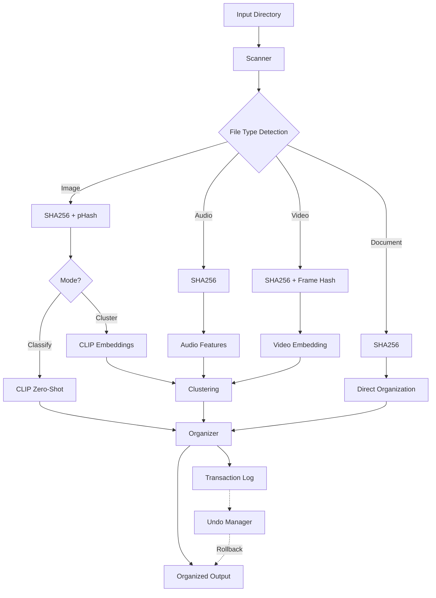

# AI-Powered File Organizer

> **Intelligent file organization with semantic classification, duplicate detection, and transaction-based undo**

A Dockerized Python application that recursively scans directories and organizes files using AI-powered semantic classification (CLIP for images, librosa for audio, video analysis), perceptual duplicate detection, and a robust undo system.

## Features

- **🎯 Semantic Classification**
  - **Images**: CLIP-based zero-shot classification or automatic clustering
  - **Audio**: Feature extraction with librosa (MFCC, spectral features)
  - **Video**: Key frame extraction with CLIP embedding aggregation
  - **Documents**: MIME-type based categorization

- **🔍 Duplicate Detection**
  - **Exact**: SHA256 hash comparison
  - **Perceptual**: ImageHash (pHash/dHash) for images and videos
  - Configurable similarity thresholds

- **↩️ Transaction-Based Undo**
  - JSONL transaction log for all operations
  - Integrity verification via SHA256
  - Rollback support for copy/move operations

- **🐳 Fully Dockerized**
  - Multi-stage build for optimal image size
  - Offline-capable with model caching
  - Non-root user for security
  - GPU support (optional)

- **⚡ Performance**
  - Batch processing with configurable workers
  - Embedding caching (SQLite)
  - PCA dimensionality reduction
  - Progress bars and rich console output

## Project Structure

```
file-organizer/
├── src/
│   ├── cli.py                    # CLI entry point
│   ├── config.py                 # Configuration management
│   ├── models.py                 # Data models
│   ├── scanner.py                # Directory traversal
│   ├── filetype.py               # MIME type detection
│   ├── hashing.py                # SHA256 + perceptual hashing
│   ├── organizer.py              # File organization logic
│   ├── undo_manager.py           # Transaction log & undo
│   ├── clustering.py             # K-means, HDBSCAN, PCA
│   ├── features/
│   │   ├── cache.py              # Embedding cache
│   │   ├── image_features.py     # CLIP embeddings
│   │   ├── audio_features.py     # librosa features
│   │   └── video_features.py     # Key frame extraction
│   └── utils/
│       └── logging.py            # Structured logging
├── tests/                        # Unit tests
├── scripts/
│   └── download_models.py        # Pre-cache models
├── Dockerfile                    # Multi-stage Docker build
├── docker-compose.yml            # Easy deployment
├── pyproject.toml                # Project config
├── requirements.txt              # Dependencies
└── README.md                     # This file
```

## Quick Start

### Prerequisites

- Docker (20.10+)
- Docker Compose (optional, for easier usage)
- For GPU support: NVIDIA Docker runtime

### Installation

1. **Clone the repository** (or copy files):
   ```bash
   cd file-organizer
   ```

2. **Build the Docker image**:
   ```bash
   docker build -t file-organizer .
   ```

   This will create a ~3-4GB image with all dependencies.

### Basic Usage

#### Option 1: Docker Run

```bash
docker run --rm \
  -v /path/to/input:/data/input:ro \
  -v /path/to/output:/data/output \
  -v /path/to/logs:/data/logs \
  -v file-organizer-models:/models \
  file-organizer \
  organize \
  --input /data/input \
  --output /data/output \
  --mode cluster \
  --copy
```

#### Option 2: Docker Compose

Edit `docker-compose.yml` to set your paths, then:

```bash
docker-compose up
```

## Usage Examples

### 1. Organize with Automatic Clustering

```bash
docker run --rm \
  -v $(pwd)/my_files:/data/input:ro \
  -v $(pwd)/organized:/data/output \
  -v $(pwd)/logs:/data/logs \
  file-organizer \
  organize \
  --input /data/input \
  --output /data/output \
  --mode cluster \
  --copy \
  --workers 4
```

**Output structure**:
```
organized/
├── images/
│   ├── cluster_0/
│   ├── cluster_1/
│   └── cluster_2/
├── audio/
│   ├── cluster_0/
│   └── cluster_1/
├── videos/
│   └── cluster_0/
├── documents/
│   └── uncategorized/
└── duplicates/
    ├── exact/
    │   └── abc12345/
    └── perceptual/
        └── photo.jpg/
```

### 2. Zero-Shot Classification with Custom Labels

```bash
docker run --rm \
  -v $(pwd)/photos:/data/input:ro \
  -v $(pwd)/organized:/data/output \
  file-organizer \
  organize \
  --input /data/input \
  --output /data/output \
  --mode classify \
  --labels "nature,urban,portrait,abstract" \
  --copy
```

**Output structure**:
```
organized/
├── images/
│   ├── nature/
│   ├── urban/
│   ├── portrait/
│   ├── abstract/
│   └── uncategorized/
└── ...
```

### 3. Move Files (Instead of Copy)

```bash
docker run --rm \
  -v $(pwd)/input:/data/input \
  -v $(pwd)/output:/data/output \
  -v $(pwd)/logs:/data/logs \
  file-organizer \
  organize \
  --input /data/input \
  --output /data/output \
  --move \
  --mode cluster
```

⚠️ **Warning**: Using `--move` will relocate files from the input directory!

### 4. Dry Run (Preview Only)

```bash
docker run --rm \
  -v $(pwd)/input:/data/input:ro \
  -v $(pwd)/output:/data/output \
  file-organizer \
  organize \
  --input /data/input \
  --output /data/output \
  --dry-run \
  --verbose
```

### 5. Undo Last Operations

```bash
docker run --rm \
  -v $(pwd)/output:/data/output \
  -v $(pwd)/logs:/data/logs \
  file-organizer \
  undo \
  --log-file /data/logs/organize.jsonl \
  --count 10
```

This will undo the last 10 transactions (delete copied files or move back moved files).

## Configuration Options

### Main Command: `organize`

| Option | Description | Default |
|--------|-------------|---------|
| `--input`, `-i` | Input directory to scan (required) | - |
| `--output`, `-o` | Output directory (required) | - |
| `--mode`, `-m` | `classify` or `cluster` | `cluster` |
| `--labels`, `-l` | Comma-separated labels for classify mode | - |
| `--copy / --move` | Copy files (safe) or move them | `--copy` |
| `--workers`, `-w` | Number of parallel workers | `4` |
| `--models-cache` | Model cache directory | `/models` |
| `--log-file` | Transaction log path | `output/organize.jsonl` |
| `--min-similarity` | Perceptual hash threshold (0-64) | `5` |
| `--dry-run` | Simulate without file operations | `False` |
| `--verbose`, `-v` | Debug output | `False` |

### Undo Command: `undo`

| Option | Description | Default |
|--------|-------------|---------|
| `--log-file` | Transaction log path (required) | - |
| `--count`, `-n` | Number of transactions to undo | `1` |
| `--dry-run` | Preview undo without execution | `False` |
| `--verbose`, `-v` | Debug output | `False` |

## Advanced Usage

### Pre-Download Models for Offline Use

To fully enable offline operation, uncomment the model download step in `Dockerfile`:

```dockerfile
# Uncomment this line in Dockerfile:
RUN python scripts/download_models.py --cache /models
```

Then rebuild:

```bash
docker build -t file-organizer .
```

Alternatively, download models manually and mount the cache:

```bash
# On host machine
mkdir -p ./models_cache
docker run --rm \
  -v $(pwd)/models_cache:/models \
  file-organizer \
  python scripts/download_models.py --cache /models

# Use in subsequent runs
docker run --rm \
  -v $(pwd)/models_cache:/models:ro \
  ...
```

### GPU Acceleration

Enable GPU support in `docker-compose.yml`:

```yaml
deploy:
  resources:
    reservations:
      devices:
        - driver: nvidia
          count: 1
          capabilities: [gpu]
```

Or use `--gpus` flag with `docker run`:

```bash
docker run --rm --gpus all \
  -v $(pwd)/input:/data/input:ro \
  ...
```

### Custom Clustering Algorithm

```bash
docker run --rm ... \
  organize \
  --input /data/input \
  --output /data/output \
  --mode cluster \
  # Use HDBSCAN for automatic cluster detection
  --clustering-algorithm hdbscan
```

**Available algorithms**:
- `kmeans`: K-means (requires `--n-clusters` or auto-detects)
- `hdbscan`: Density-based, auto-detects clusters
- `agglomerative`: Hierarchical clustering

## Architecture



## Transaction Log Format

Example `organize.jsonl`:

```json
{
  "id": "123e4567-e89b-12d3-a456-426614174000",
  "timestamp": "2025-11-26T00:00:00Z",
  "operation": "copy",
  "source": "/data/input/photo.jpg",
  "destination": "/data/output/images/nature/photo.jpg",
  "sha256": "abc123...",
  "file_type": "image",
  "label": "nature",
  "cluster_id": null,
  "metadata": {"mime_type": "image/jpeg"}
}
```

## Troubleshooting

### Issue: "Permission denied" errors

**Solution**: Ensure the mounted directories have appropriate permissions:

```bash
# On Linux/Mac
sudo chown -R 1000:1000 ./input ./output ./logs

# Or run container as current user
docker run --user $(id -u):$(id -g) ...
```

### Issue: Out of memory during processing

**Solution**: Reduce batch size or number of workers:

```bash
--workers 2 --batch-size 8
```

### Issue: CLIP model download fails

**Solution**: Check internet connection or use pre-cached models. Set environment variable:

```bash
docker run --rm \
  -e HF_HUB_OFFLINE=1 \
  -v $(pwd)/models_cache:/models:ro \
  ...
```

### Issue: Video processing is slow

**Solution**: Reduce frame extraction frequency:

```bash
--video-frame-interval 10  # Extract every 10 seconds
--max-video-frames 5       # Maximum 5 frames per video
```

## Performance Tips

1. **Use GPU** for 10x faster image processing
2. **Pre-cache models** to avoid download delays
3. **Reduce dimensions** with PCA for faster clustering
4. **Batch processing** with appropriate worker count (CPU cores)
5. **Embeddings cache** persists across runs for speed

## Development

### Local Setup (Without Docker)

```bash
# Install dependencies
pip install -r requirements.txt

# Run directly
python -m src.cli organize --help
```

### Running Tests

```bash
pytest tests/ -v
```

### Type Checking

```bash
mypy src/
```

### Linting

```bash
ruff check src/
black src/
```

## Acknowledgments

- [CLIP](https://github.com/openai/CLIP) by OpenAI
- [librosa](https://librosa.org/) for audio analysis
- [ImageHash](https://github.com/JohannesBuchner/imagehash) for perceptual hashing
- [HuggingFace Transformers](https://huggingface.co/transformers)

---

**Note**: This tool is designed for personal/organizational use. Always backup important data before running file operations!
